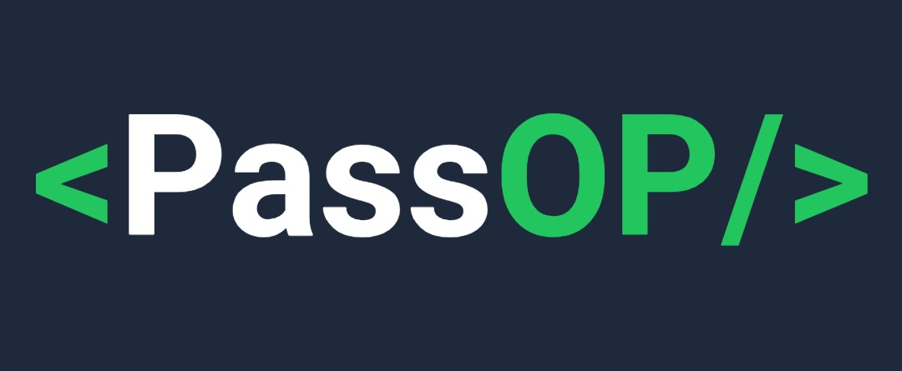
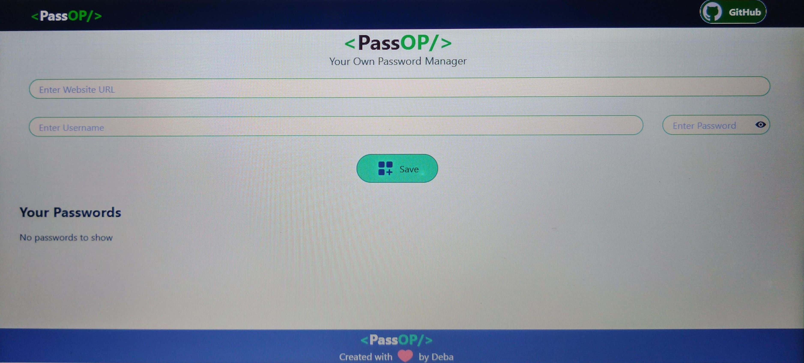
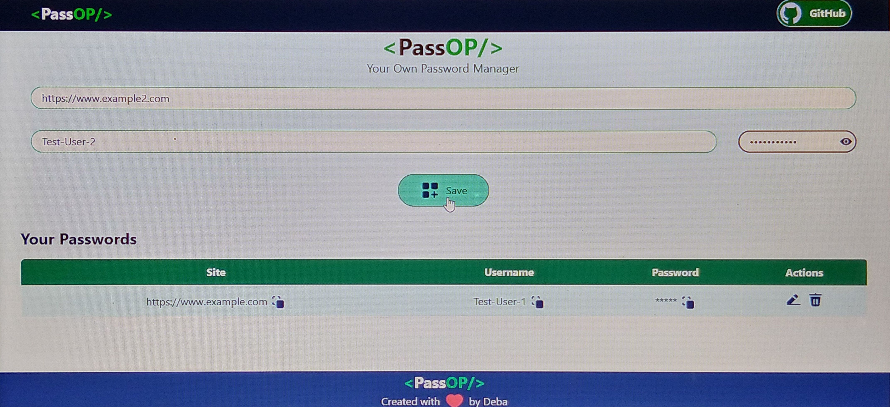
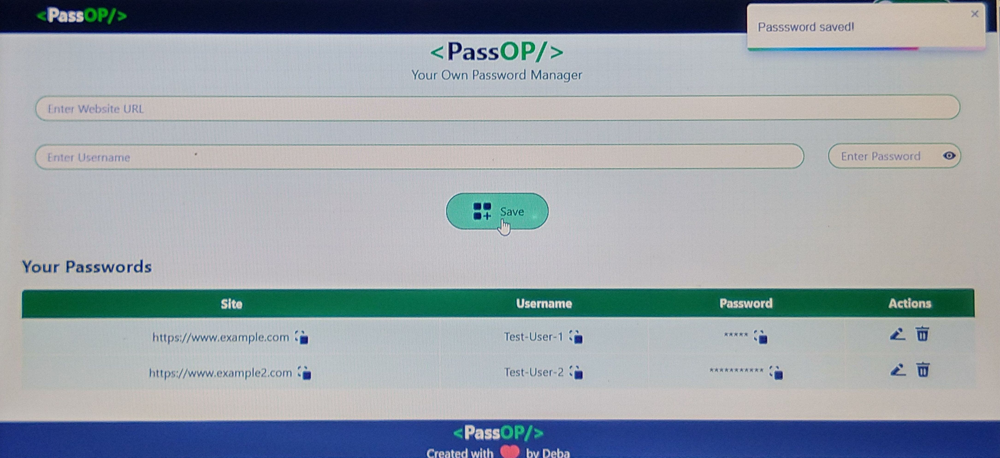
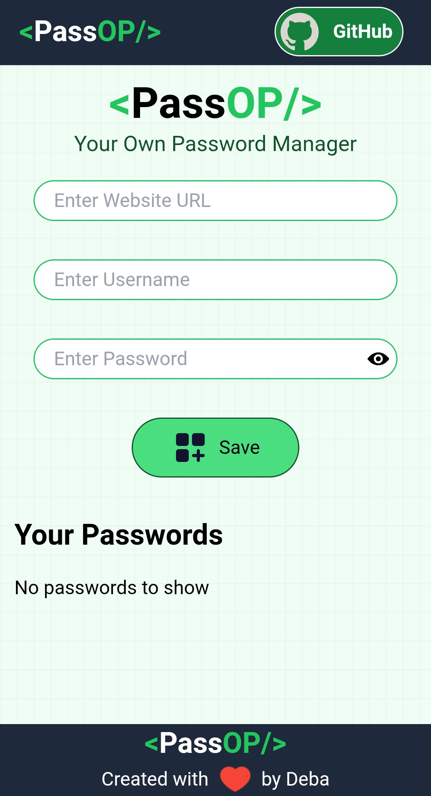

<div align="center">
  
  <h1>PassOp 🔐</h1>
  <p><b>Your Personal Password Manager – Secure. Fast. Simple.</b></p>

  [](https://github.com/2000Deba/PassOp/stargazers)
  [](https://github.com/2000Deba/PassOp/network/members)
  [](https://github.com/2000Deba/PassOp/issues)
  [](LICENSE)
  
  <br/>
  
  🌐 **Live Demo:** [https://2000deba.github.io/PassOp/](https://2000deba.github.io/PassOp/)
</div>

---

## ✨ Features

- 🔐 **Save Passwords** locally & securely
- ➕ **Add / Edit / Delete** passwords easily
- 📋 **Copy to Clipboard** for site, username, and password
- 👁️ **Show / Hide Passwords** with one click
- 📱 **Fully Responsive** UI for mobile & desktop
- ⚡ **React + Vite** powered ultra-fast app
- 🎨 Clean & modern UI using **Tailwind CSS**

---

## 🖼️ Screenshots

### **Home Page**


### **Saved Passwords**



### **Mobile Responsive View**


---

## 🛠️ Tech Stack

| Technology          | Purpose                          |
|---------------------|----------------------------------|
| **React.js**        | Component-based UI development   |
| **Vite**            | Fast development & optimized build tool |
| **Tailwind CSS**    | Modern responsive UI styling     |
| **React Toastify**  | Beautiful toast notifications    |
| **UUID**            | Generate unique IDs for each entry |

---

## ⚡ Installation Guide

### **1. Clone the repository**
```bash
git clone https://github.com/2000Deba/PassOp.git
cd PassOp
```

### **2. Install dependencies:**
```bash
npm install
```

### **3. Run the development server:**
```bash
npm run dev
```

### **4. The app will be running at:**
```
http://localhost:5173
```

### **5. Build for production:**
```
npm run build
```

---

## 🚀 Deployment (GitHub Pages)

<p>This project is deployed using <b>GitHub Pages.</b>
To deploy, simply run:</p>
```
npm run deploy
```

---

## 📜 License

This project is licensed under the **MIT License**. See the [LICENSE](LICENSE) file for details.

---

## 👨‍💻 Author

**Debasish Seal**

- GitHub: [@2000Deba](https://github.com/2000Deba)
- Live Demo: [PassOP](https://2000deba.github.io/PassOp/)

---

## 💡 Future Enhancements
- 🔐 Add AES Encryption for saved passwords
- ☁️ Integrate with MongoDB + Express backend
- 📱 Add PWA Support for offline usage
- 🧩 Export & Import saved passwords feature

---

<div align="center"> <b>⭐ Star this repo if you like it!</b><br/> Made with ❤️ by <a href="https://github.com/2000Deba">Debasish Seal</a> </div>